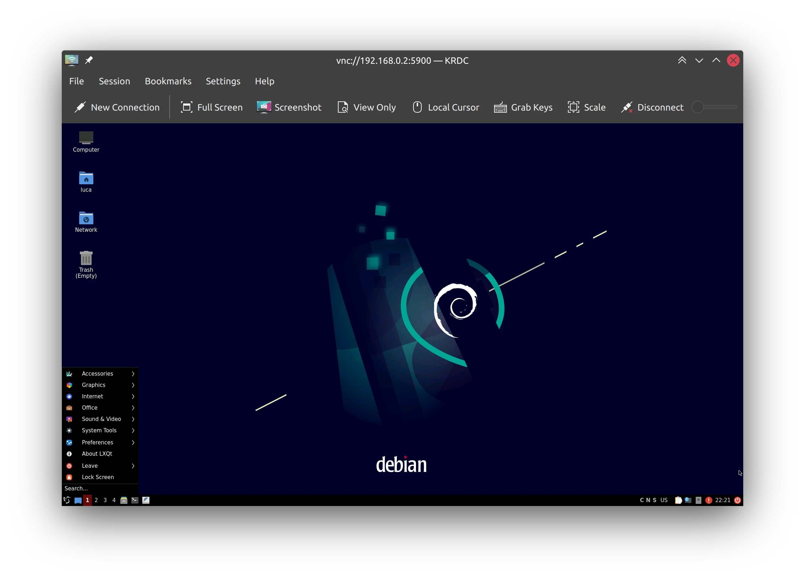
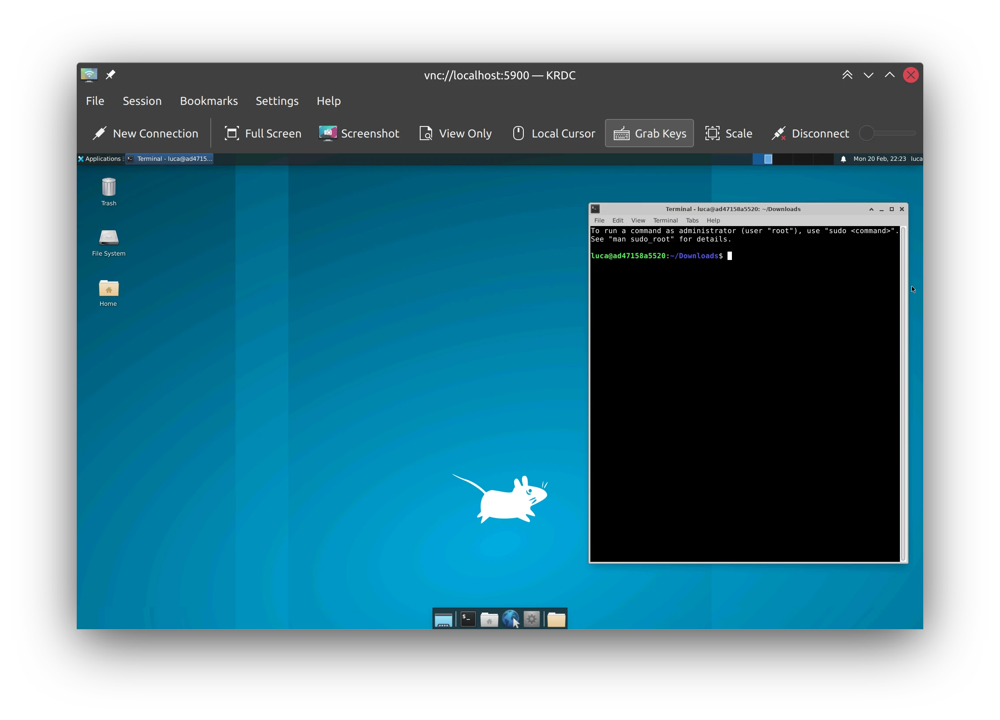

# Docker VNC desktop

Docker VNC desktop contains the scripts needed to build images including clean DE's with VNC support. Images are supposed to be as light as possible and simple to run. I use these images mostly for development purposes or quick tasks.

## LXQT on docker on Raspberry Pi (arm64)

```docker run --rm -e USER=luca -e RESOLUTION=1920x1080 -p 5900:5900 carlonluca/vnc-desktop:jammy-lxqt```



## XFCE (amd64)

```docker run --rm -e USER=luca -e RESOLUTION=1920x1080 -p 5900:5900 carlonluca/vnc-desktop:jammy-xfce```



## Run

To simply run the image and expose the port to localhost use:

```docker run --rm -p 5900:5900 carlonluca/vnc-desktop:bullseye-xfce```

This will run the DE as the root user. To run it as a regular user set the USER variable:

```docker run --rm -e USER=luca -p 5900:5900 carlonluca/vnc-desktop:bullseye-xfce```

The resolution is set to a default, which is frequently too small. Setting the RESOLUTION env variable is sufficient to change it:

```docker run --rm -e USER=luca -e RESOLUTION=1920x1080 -p 5900:5900 carlonluca/vnc-desktop:bullseye-xfce```